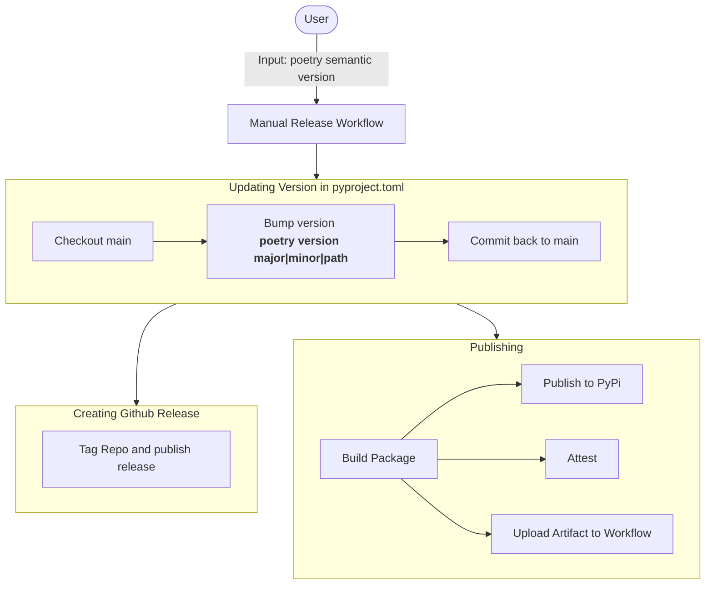
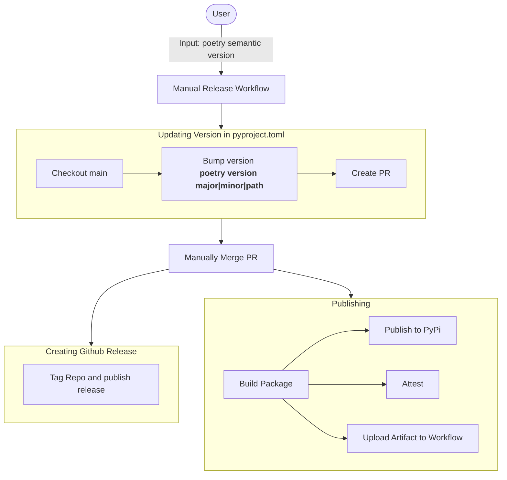

# Publishing Workflow

## Current - Manual Workflow Dispatch

Currently, the release is automated after the "Manual Release Workflow" is dispatched from Github Actions.
The key parts of it are:
1. Bumping the version automatically using the user input.
   2. The semantic version that come from user input is used to run `poetry version [user input]`
2. Creating GitHub Release which involves creating a git tag with the latest version
3. Publishing to PyPi
4. Attest the build provenance (Optional)
5. Upload build artifact to GitHub Actions (Optional)

## Alternative: Manual Workflow Dispatch With Pull Request
This may be a better approach because it doesn't involve making unreviewed commits to the repo.

